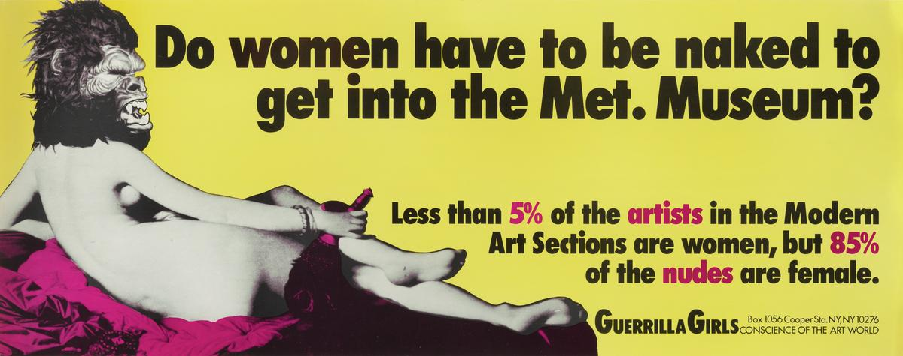
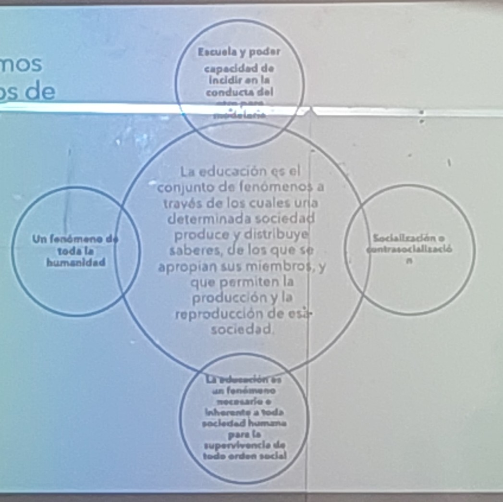

# sesion-02

2026-03-17, martes

## cátedra

Pedagogía:

desde una perspectiva sociológica es una interacción.

La pedagogía se encuentra tensionada entre 2 ángulos, entre socilización y transformación.

La transminsión se conecta con la pedago´gia tradicional, y la transformación se conecta con la pedagogía crítica.

Bernstein postula que existe la pedagogía visible y la invisible. La pedagogía invisible es aquella que es una "reproducción" por parte del docente, algo que hace incnscientemente.

Mark Lange: lo que miramos está mediado por cómo aprendimos a mirar. Cuando observamos una obra de arte, tenemos que preguntamos qué estanmos observado

## políticas de la mirada

Robert Doisneau habla de la forma socialidad del mirar. Históricamente a hombres y mujeres se las ha enseñado a mirar distinto.

## la educacion y la pedagogía

existen espacios educativos no formales(yo opino que todolugar con el que no estés familiarizado es un espacio educativo informal), como el cine, el teatro, etc.

Existen espacios educativos pedagógicos formales e informales. Para que cuente como formal tiene que estar delcarado como un espacio para aprender, tener objetivos de aprendizaje.

Cuando hablamos de educación, estamos hablando de socialización. La educación puede buscar socializar o contra socializar

La pedagogía excede la escuela, pero en nuestra experienci ay forma de vida, esta estpa mediada por la escuela.

## la educación

Práctica social y acción. Tiene una direccionalidad y un significado histórico.

- es social
- es universal
- transmite saberes e implica relaciones de poder: intencionalidad
- es institucionalizada o pautada
- es una práctica histórica

la escuela como agencia cultural, es producto de la modernidad (siglo XVIII). La escuela sirve para formar un ciudadano ciudadano.

### educación y escolarización

La educación formal son 12 años. Antes de Bachelet-1 la escuela garantizaba hasta 2do medio(10 años)

Escolarización se entiende como el conjutno de fenómenos de producción, distribución y apropiación de saberes que lleba a cabo la institución escolar. Escolarización no es solo la cantidad de años que pasas en la escuela, es la experiencia cultural que pasas durante ese tiempo.

entre el siglo XIX y XX se centraron esfuerzo en que la población aprenda a leer. La escritura se comenzó a impulsar cmo en 1960. En el mundo el porcentaje de alfabetozación se convirtió en un indicador del índice de desarrollo.

## actividad

nos entregan un sobrecito con citas.

- ¿qué conceptos asociados al triunfo de la escuela moderna puede encontrarse en los fragmentos leídos?
- ¿cómo puede relacionarlo al concepto de escuela actual?

### relevante

- [Serie "Ojo con el Arte" cap 1](https://youtu.be/1qj2B9WipTE)
- libros álbumes
