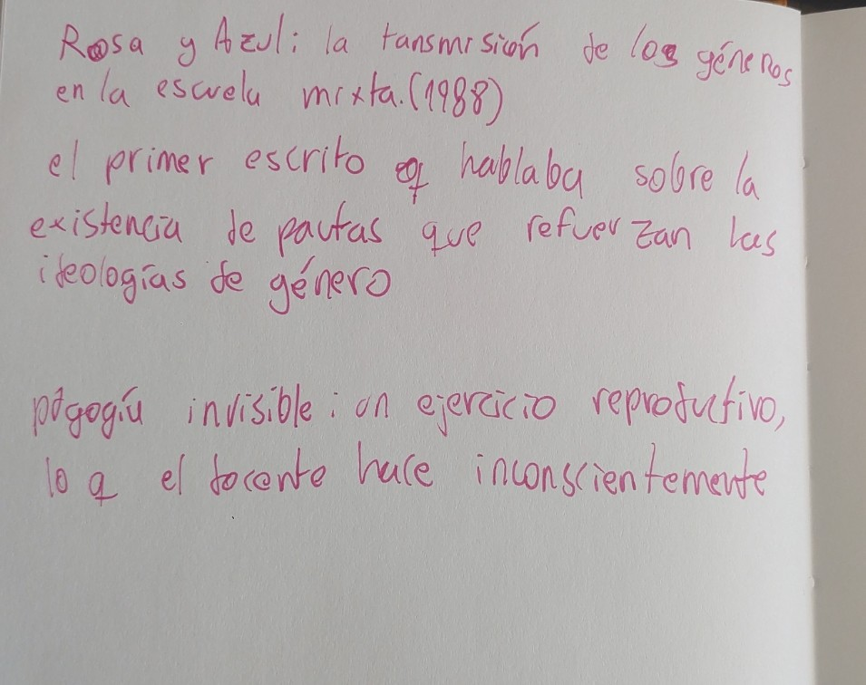
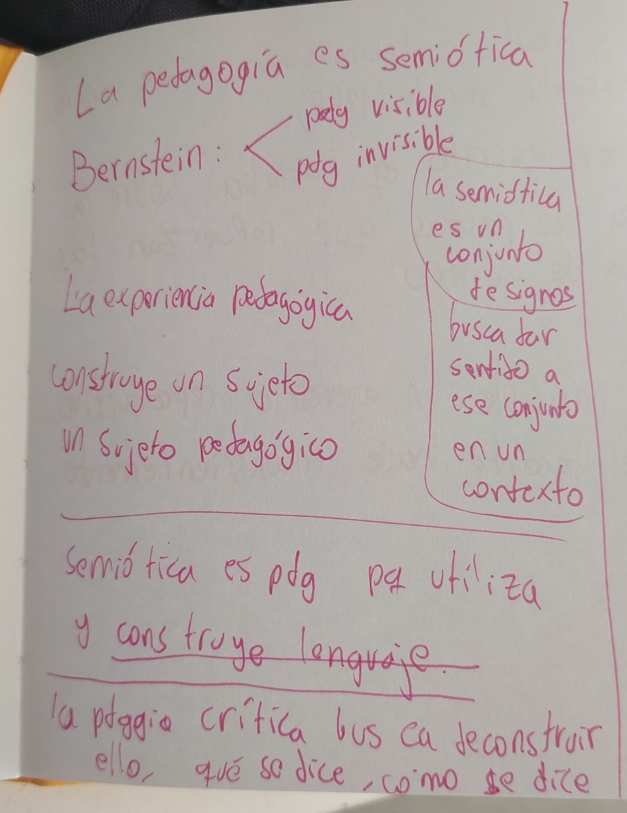

# sesion-02

2026-03-17, martes

Pedagogía:

desde una perspectiva sociológica es una interacción.

La pedagogía se encuentra tensionada entre 2 ángulos, entre socilización y transformación.

La transminsión se conecta con la pedago´gia tradicional, y la transformación se conecta con la pedagogía crítica. 

Bernstein postula que existe la pedagogía visible y la invisible. La pedagogía invisible es aquella que es una "reproducción" por parte del docente, algo que hace incnscientemente.

Mark Lange: lo que miramos está mediado por cómo aprendimos a mirar