# sesion-03

2026-03-24

## cátedra

La escuela como mecanismo pedagógico máximo.

"Guía para las escuela cristianas"-Juan Bautista la Salle. El primer escrito que funcionó como manual para enseñar.

"Todos a la escuela" - Joseph Lancaster. La escuela en cuanto infraestructura toma mucho de la iglesia. Propone la idea de que todos vayan a la escuela.

En chile la docencia se impartía en la "Escuela Normal": institución destinada a instruir docente

La escuela es una experiencia. La literatura recoje esta experiencia, existe literatura que relata la experiencia de al escuela. Alejandro Zambra es uno de los autores más destacados de relatos de experiencia escolar.

### literatura sobre la experiencia escolar

- facsímil
- mis documentos
- avenida 10 de julio

### metodologías de la investigación cualitativas

- facsímies: Es como un cuadernillo con preguntas.
- autobiografía: relevante cuando se investiga la experiencia

siempre en un proceso investigativo debo señalar desde qué lugar estoy investigando. Donna Haraway postula que no hay distancia entro lo investigado y el investigador

Giro cultural: cuando se busca otras alternativas para la investigación.

### currículo nacional

los colegios municipales y subvencionados, deben apegarse estrictamente al currículo nacional. Los colegios privados tiene un poco más de flexibilidad.

el currículo nacional dicta cómo se definen las etapas del proceso formativo.

## actividad

construir un pequeño relato de mi autobiografía escolar a partir de los aspectos que se piden.

1. desarrolla la pregunta 1 en un relato, para luego compartirla con un compañere y sistematizarla con la pregunta 2
2. pregunta 3 (se realiza con lectura de Pineau, para ello revisar fichas entregadas)

40 minutos en total.

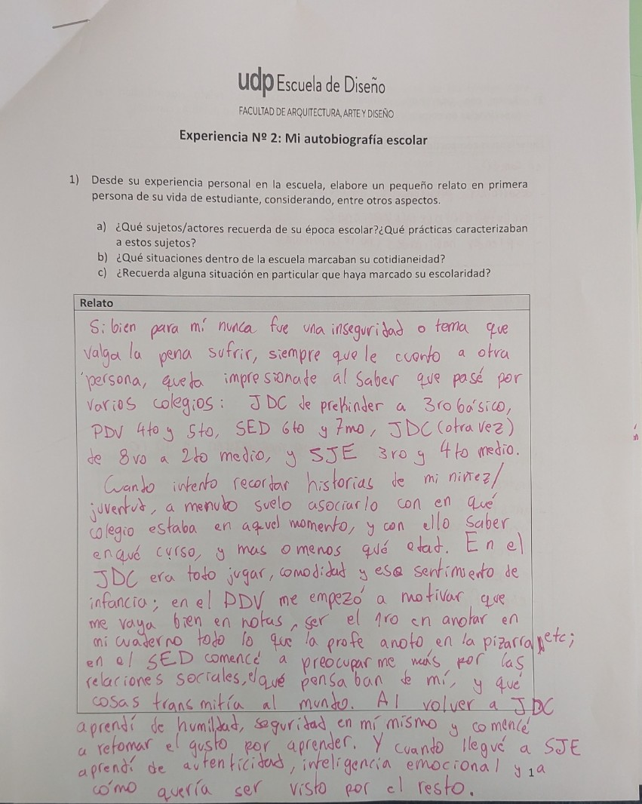
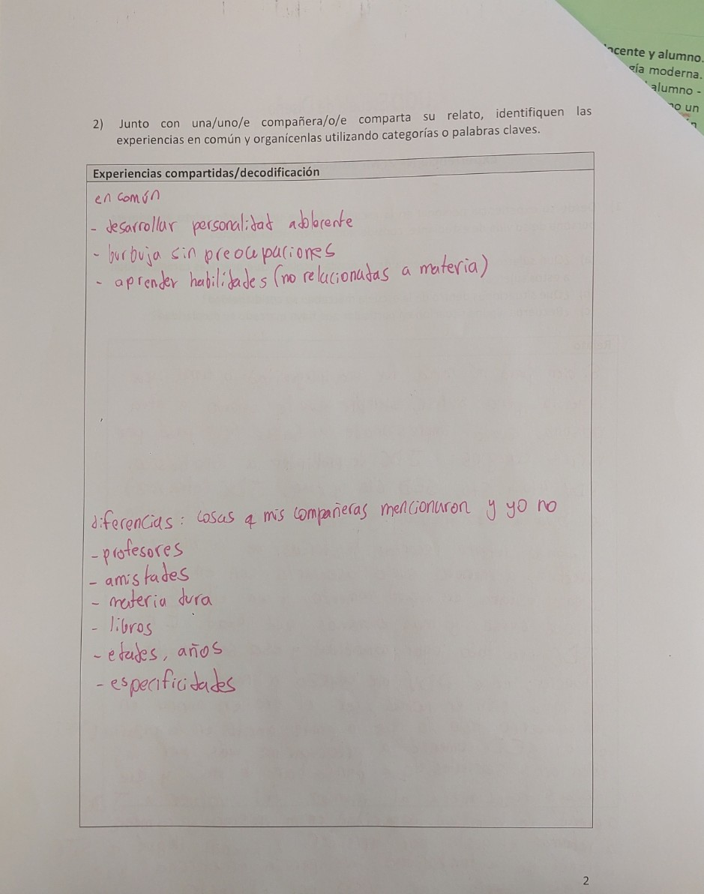

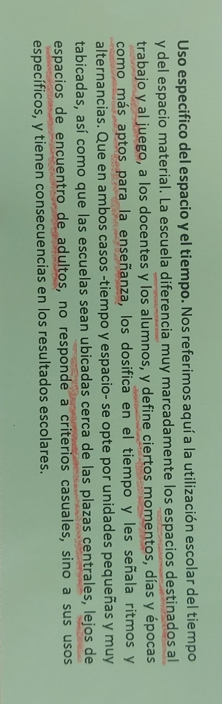
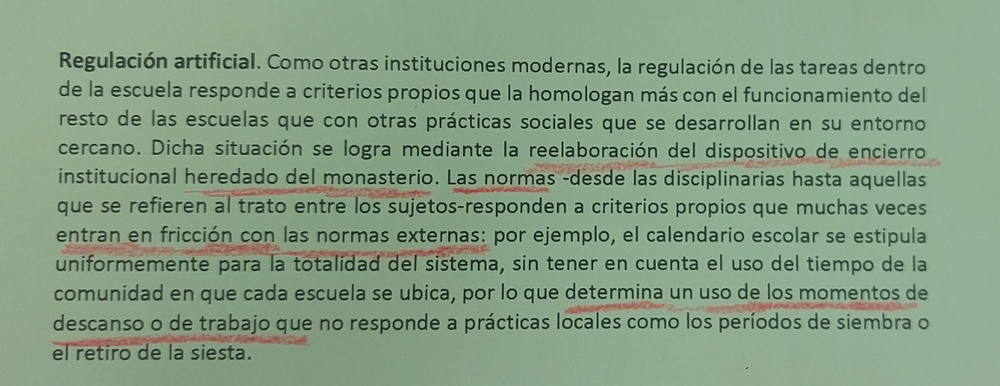
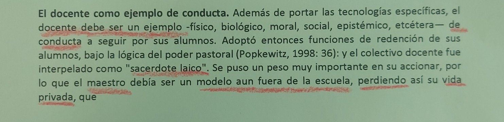
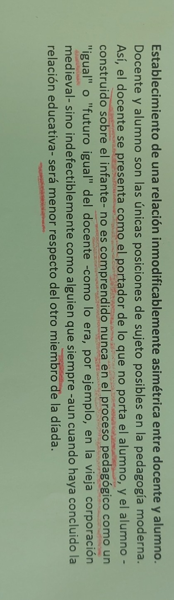
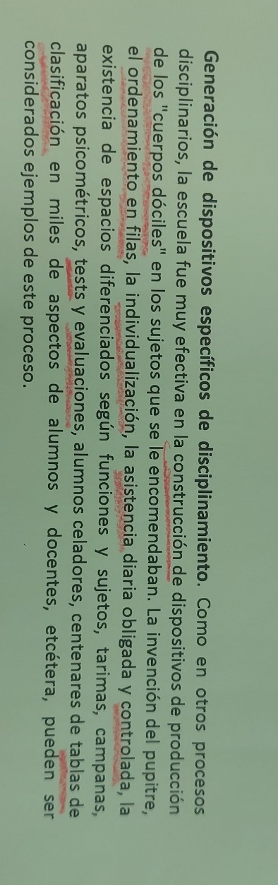
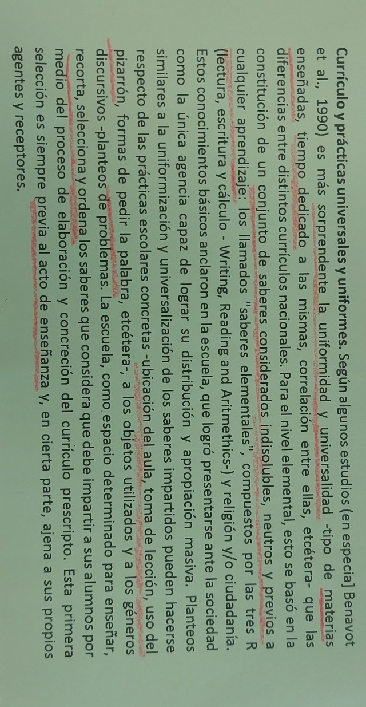

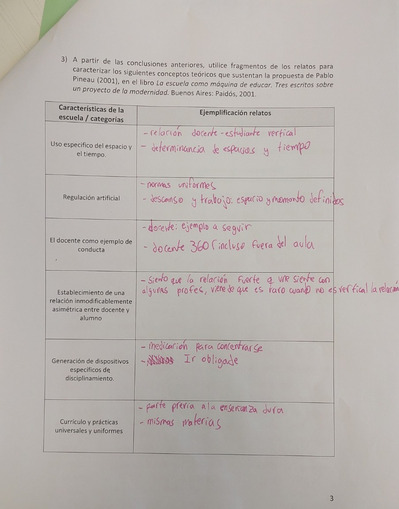

## clase postbreak

Genealogía de lo pedagógico:

en los 90 nace la idea q la escuela es para niñes.

La educación es un a práctica porque es lago que las personas efectivamente hacen. Tienen direccionalidad y significado histórico.

Nosotres nos centraremos en los sujetos de esta interacción: la infancia.

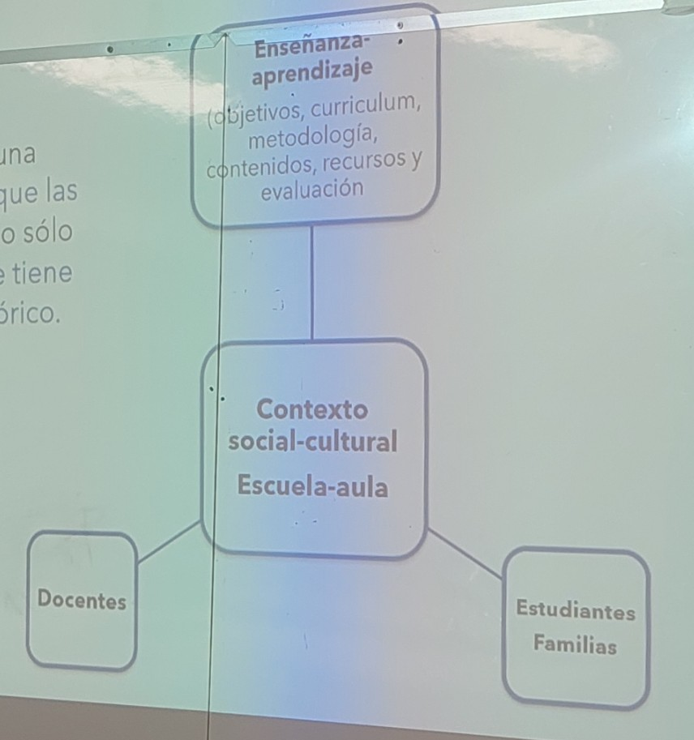

### la escuela y la construcción de la infancia

es una relación mututa, la infancia también construye la escuela. La escuela es regulador, define lo que es la infancia normal. Por ella entendemos a un niñe q no va a ala escuela como "marginal"

Esta idea de la infancia, consolida la idea de la maternidad.

Les niñes comienzan a ser un proyecto utópico, cuidar el MA por les niñes del futuro, etc.

### infancia y diseño

antecdente: [el juego del arte](https://www.march.es/es/madrid/exposiciones/juego-arte)

el disñeo entra a la infancia desde el arte. Y así, el diseño entra a las aulas.

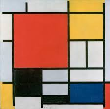

Piet Mondrian

La infancia comienza a ser entendida como sujeto que necesita aprender.

- F. froedel: aprender jugando.

- Montessori: objetos sensorial, progresivo, estético y manipulable.

#### solemne-01

hacer un ensayo a partir de una película del listado.

## relevantes

- [Brígida Walker](https://es.wikipedia.org/wiki/Brígida_Walker)

- [Dona Haraway](https://es.wikipedia.org/wiki/Donna_Haraway)

- [El juego del arte](https://www.march.es/es/madrid/exposiciones/juego-arte)

- [Fundación Juan March](https://www.march.es/es/madrid)

- [Derechos del lector y la lectora](https://educalengua.wordpress.com/wp-content/uploads/2014/01/derechos-del-lector.pdf)

- Walter Benjamin

- Juguete - Walter Benjamin

- [Importancia del juego en el aprendizaje de educación básica](https://www.curriculumnacional.cl/614/articles-212578_recurso_pdf.pdf)

- [aprendizaje a través del juego](https://www.unicef.org/sites/default/files/2019-01/UNICEF-Lego-Foundation-Aprendizaje-a-traves-del-juego.pdf)